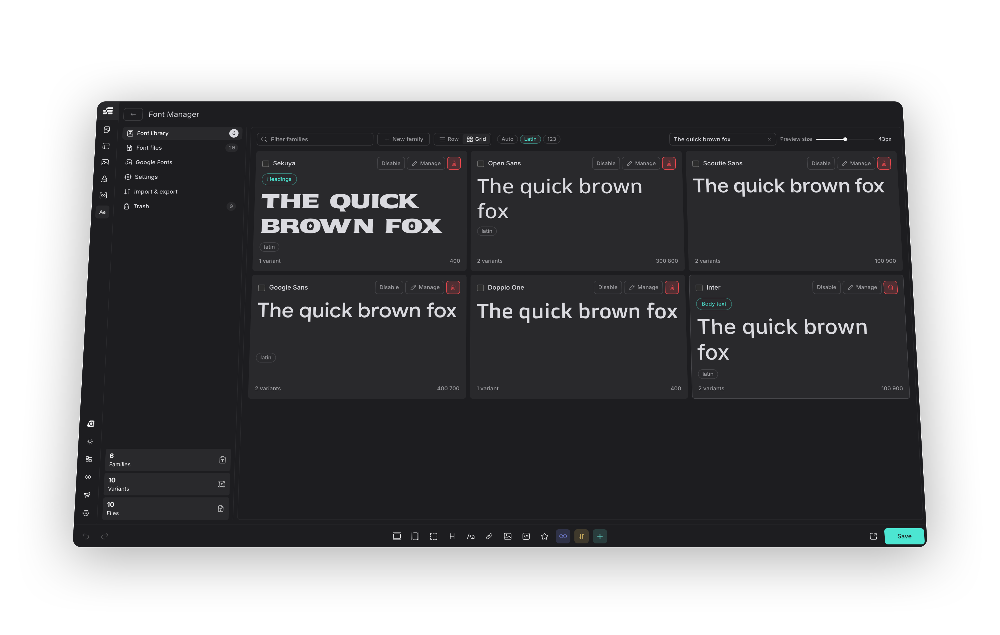

# Etch Font Manager

Manage self-hosted custom fonts **inside the Etch builder**. No trips back to the WordPress dashboard.

[](https://wordpress.org/) [](https://www.php.net/) [](https://docs.etchwp.com/) [](LICENSE) [](https://github.com/donkanishka/etch-font-manager/releases/latest)



The plugin registers a **Font Manager** control in the Etch Settings Bar using Etch's official
[Controls API](https://docs.etchwp.com/integrations/controls) and opens a docked panel that follows the
builder's own panel conventions (sizing, tokens, typography, focus styles, light/dark scheme).

## Features

- **Native Settings Bar control** — registered through `window.etchControls.builder.settingsBar`, grouped with Etch's own managers at the end of the top section.
- **Full-screen manager** — mirrors Etch's native manager pattern (Content Hub, Style Manager, Asset Manager): a takeover surface beside the settings bar, a 40px header and a 256px inner navigation column, all built from Etch's own design tokens so it follows the builder's colour scheme.
- **Specimen-first browsing** — Library and Google Fonts render in your choice of **Row** or **Grid**, with editable preview text, a 14-72px size slider, and each family previewed in its own script rather than a Latin pangram (Google Fonts prefers Latin, since a search page mixes scripts by nature).
- **Upload fonts** — drag and drop `.woff2`, `.woff`, `.ttf`, `.otf` files. A file already in the library, including a convertible original whose WOFF2 twin you already hold, is refused before it is even sent.
- **Built-in WOFF2 converter** — drop a `.ttf`, `.otf` or `.woff` and it is converted to WOFF2 before it is uploaded. Source Code Pro goes 205 KB → 72 KB from TTF and 128 KB → 74 KB from OTF; WOFF saves less (17-23%) because it is already compressed. WOFF is unwrapped back to sfnt with the browser's own `DecompressionStream` before compressing, which is byte-exact and needs no extra download. Files already on the server can be converted from the Uploaded files list, with every family variant repointed at the new file automatically. It runs entirely in your browser — `google/woff2` compiled to WebAssembly, in a Web Worker — so **no font is ever sent to a third-party service**. The conversion is lossless: variable axes, named instances and OpenType features are carried through untouched. It is not a subsetter. The same WebAssembly module also **decodes** a WOFF2 just far enough to read its `fvar` table, which is how an uploaded variable WOFF2 gets working axis sliders without ever leaving your browser.
- **Google Fonts** — search, filter by category or writing system, sort, and one-click install. Files are downloaded locally, so the frontend makes no requests to Google.
- **Subset support** — choose which subsets to download (latin, latin-ext, sinhala, tamil, cyrillic, greek, vietnamese and so on). Each `@font-face` gets a matching `unicode-range`, so browsers only fetch the scripts a page actually uses. A family's own script is preselected alongside latin, so installing e.g. Noto Sans Sinhala from a single click does not silently produce a font with no Sinhala glyphs.
- **Filename detection** — weight and style are read from uploaded file names (`Inter-SemiBoldItalic.woff2`, `Roboto-300.woff2`) and applied when the file is mapped.
- **Variable font support** — axes are read straight from the file, including a WOFF2. A tester lets you tune an instance per family; the chosen `font-variation-settings` value is written into the family's own CSS and is what the site actually renders, not the default cut.
- **Typography tokens** — publish a family as the site's heading or body font under the `--heading-font-family` / `--text-font-family` custom properties Etch documents and Automatic.css reads, so a framework picks it up without you writing a rule. Each token belongs to exactly one family at a time.
- **Delivery controls** — per-family `font-display`, a preload toggle for the cut a page renders first, a fallback stack, an `Apply to` selector list, and an optional metric-matched local fallback face that holds the line height steady while the real font loads.
- **Enable, disable and trash** — switch a family off without deleting it (no `@font-face`, no custom property, no preload, but files and mapping are kept), or move it to a trash you can restore from. Deleting permanently drops the record only; font files are always removed by a separate explicit action, and are never touched at all when the plugin itself is deleted unless you opt into that in Settings.
- **Guard rails** — warnings before closing with unsaved edits, before an install would replace variants you already have, or before deleting a file that variants still map.
- **Family and variant mapping** — assign files to weights and styles, all inline in the panel. Files already on the server but not mapped to any family can be adopted into one.
- **A CSS variable per family** — every family is published as `--efm-family-{slug}`, so `"Noto Sans Sinhala"` is usable as `var(--efm-family-noto-sans-sinhala)` in an Etch style record, an ACSS override or any stylesheet. The value carries the family's fallback stack, and the family editor shows the variable ready to copy. This is the intended way to wire a family into Automatic.css: set `--heading-font-family: var(--efm-family-inter)` in ACSS itself, where the rest of your typography already lives.
- **Portable import and export** — export chosen families as JSON, optionally with the font files bundled in, and preview exactly what an import will add, overwrite and remove before applying it — a genuine dry run that writes nothing until you confirm. Bundled files are validated by their format signature before being written.
- **Stylesheet delivery** — the generated CSS is cached to a file and enqueued, or printed inline if you prefer one less request. Shows when it was last built, with a regenerate action.
- **Blocks other plugins' Google Fonts** — an optional privacy setting that dequeues any stylesheet pointing at `fonts.googleapis.com` and strips the matching preconnect hints.
- **Generated CSS preview** — see exactly what a family contributes, live as you edit it.
- **Instant canvas refresh** — the generated stylesheet is reloaded in the builder shell and canvas iframe after every change; no page reload.
- **Self-hosted and GDPR friendly** — everything is served from your own fonts directory.
- **Block editor aware** — family names are registered in `theme.json` so Gutenberg font pickers list them (without duplicate `@font-face` output).

## Multisite storage and WOFF limits

On multisite, each site stores fonts and generated CSS beneath `wp-content/fonts/efm-sites/{blog_id}/`,
including the main site. Custom storage-directory and URL filters remain base locations; the site namespace
is appended afterwards. Existing mapped fonts are copied without deleting shared originals or overwriting
legacy shared CSS. Unmapped legacy files are not automatically adopted. Migration requires local filesystem
locking and hard-link support for atomic publication; failed copies retry without accepting partial files.

WOFF reconstruction validates table ranges and sizes before allocating output, processes tables sequentially,
and feeds the native decompressor in small bounded chunks. Reconstructed fonts larger than 64 MiB are not
converted; supply TTF, OTF or WOFF2 instead. This is an output limit, not a cap on total browser memory.
Single-site storage paths are unchanged.

## Requirements

- WordPress 6.0+
- PHP 7.4+
- Etch 1.6+ (the Controls API is required for the in-builder panel)
- Automatic.css is optional; families are exposed as CSS variables you can feed into it

## Installation

1. Download the zip from the [latest release](https://github.com/donkanishka/etch-font-manager/releases/latest).
2. In WordPress go to **Plugins > Add New > Upload Plugin**, upload it and activate.
3. Open the Etch builder. The **Font Manager** icon appears in the Settings Bar with Etch's other managers.

## Updates

After the first install the plugin updates itself from GitHub releases. New versions show up on the normal
**Dashboard > Updates** screen with the release notes in the details modal, so there is no zip to upload again.

The routine check reads `update.json` from the raw CDN, which has no API rate limit. GitHub's REST API is only
used as a fallback, because it allows 60 unauthenticated requests an hour **per IP address** and every site
behind a shared host address draws on the same budget. A failed lookup keeps the last known release rather
than discarding it, and a rate-limited response backs off until the reported reset time.

Lookups are cached for six hours. WordPress itself only asks for update information roughly hourly on the
Plugins screen, about every minute on the Updates screen, and twice daily on cron, and both the manual
**Check for updates** link and a forced check bypass the cache, so an active check is always live.

Point the updater at a fork with `efm_updater_repo`, change the manifest branch with `efm_updater_branch`,
turn updates off with `efm_enable_updates`, or change the cache window with `efm_release_cache_ttl`.

Update packages are only accepted when they come from this repository's own releases, so a tampered manifest
cannot redirect WordPress to another download.

On activation, existing data from the older *Etch Custom Fonts* plugin is imported automatically when present.

## Usage

The manager opens from the **Font Manager** icon in the Settings Bar and has six sections: Font library, Font
files, Google Fonts, Settings, Import & export and Trash.

**Font library** — a specimen grid or row list of your font families with a filter box. *Manage* opens a family
editor for renaming the family, mapping files to weights and styles, typography tokens, delivery and the
variable-axis tester. Edits are buffered; Save and Discard appear in the header while there are unsaved changes,
and closing the panel with unsaved edits asks first.

**Font files** — drag and drop `.woff2`, `.woff`, `.ttf` or `.otf` files, with a running conversion report, and
review everything currently in the fonts folder with type, size, a search box, format chips and a way to adopt a
file already on the server into a family. Multi-select and bulk-delete are available on every table here.

**Google Fonts** — browse the whole library by category or writing system, sort by popularity, trending, newest
or A to Z, or search it. The writing-system filter is the only reliable way to answer questions like "which families can set
Sinhala". Select several families and install them in one action. Results page in 24 at a time. Families with a
weight axis can be installed as a **variable** cut: one file per subset instead of one per weight. Pick the
subsets you need first: `latin` is preselected alongside the family's own script, and other scripts it carries
are offered as toggles. Installing downloads every weight and style for the chosen subsets locally and wires the
family up for you.

**Reinstall**, on a family you already have, opens on exactly what is installed — the same subsets, the same
weights, static or variable — so pressing it with nothing changed does nothing. Change the selection and it
asks first, naming which variants would be dropped, because installing replaces a family's variant list rather
than merging into it.

> Subsets matter. A family such as Noto Sans Sinhala carries `sinhala`, `latin-ext` and `latin`. Installing
> latin alone gives you a font with no Sinhala glyphs, and the browser silently falls back to a system font.

**Family editor → Delivery** — set `font-display`, opt a family into preloading, give it a fallback stack, an
`Apply to` selector list, and optionally a metric-matched local fallback face so text does not shift when the
real font arrives.

**Family editor → Typography tokens** — publish a family as the site's heading or body font. Each token belongs
to one family; assigning it to a new family unassigns the old one.

**Import & export** — download the whole configuration as JSON and load it on another site, in replace or merge
mode, with a genuine dry run (`preview: true`) that reports what would change before anything is written. Any
font file a family references but that is missing from the destination is listed after the import.

**Trash** — a family moved here keeps its files; restore undoes it completely, and deleting permanently removes
only the record. Deleted files can be recovered separately from Import & export while they are still on disk.

**Settings** — choose whether the generated stylesheet is enqueued as a file or printed inline, regenerate it on
demand, optionally block Google Fonts loaded by other themes and plugins, delete a converted original after it
is converted, and choose whether uninstalling the plugin also deletes the font files and stylesheet it created
(off by default — removing the plugin never removes your fonts unless you ask it to).

## How fonts are delivered

| Context | Mechanism |
| --- | --- |
| Frontend | `efm-fonts.css` enqueued on `wp_enqueue_scripts` |
| Etch canvas iframe | `etch/canvas/additional_stylesheets` filter and `etch/canvas/enqueue_assets` action |
| Block editor | `enqueue_block_assets` plus `theme.json` family registration |
| Builder panel previews | Same stylesheet, refreshed with a cache-busting query after each change |

The static stylesheet uses **relative** `src` URLs, which avoids cross-origin issues inside iframes.

## Security

- All REST routes require `manage_options` (filterable via `efm_capability`) and a valid `wp_rest` nonce.
- Uploads are validated by magic bytes, not just by extension.
- File paths are resolved and confirmed to be inside the fonts directory.
- Family names are stripped of characters that could break out of a CSS declaration.
- Uploads are capped at 10 MB per file.

## Filters

| Filter | Purpose |
| --- | --- |
| `efm_capability` | Capability required to manage fonts. Default `manage_options`. |
| `efm_control_placement` | `top-end` (default), `top-start`, `center-start`, `center-end`, `bottom-start`, `bottom-end`. |
| `efm_control_icon` | Iconify icon for the control. Default `ph:text-aa-duotone`. |
| `efm_font_css` | Filter the generated CSS before it is written. |
| `efm_fonts_dir` | Change the absolute font-storage directory. Default `wp-content/fonts/`. |
| `efm_fonts_url` | Change the public URL corresponding to `efm_fonts_dir`. |
| `efm_updater_repo` | GitHub repository used for updates, in `owner/repo` form. |
| `efm_enable_updates` | Return `false` to disable GitHub updates. |
| `efm_release_cache_ttl` | Seconds to cache the release lookup. Default 21600. |
| `efm_updater_branch` | Branch holding `update.json`. Default `main`. |

### Placement note

Etch's Controls API adds a control at the **start** or **end** of a Settings Bar section. The default
`top-end` appends the Fonts control after Loop Manager, so it sits with Etch's other managers. The plugin
never moves or inserts nodes inside Etch's own DOM.

### Canvas stylesheet registration

Etch renders the canvas stylesheet list with a Svelte keyed each block keyed by `id`, and it also folds styles
enqueued on `etch/canvas/enqueue_assets` into that same list using the style handle as the id. Registering a
stylesheet through both that action and the `etch/canvas/additional_stylesheets` filter produces two entries
with the same id, which throws `each_key_duplicate` and breaks the entire builder canvas.

This plugin therefore registers the canvas stylesheet **only** through the filter, and the filter skips itself
if an entry for the stylesheet is already present.

## REST API

Namespace `etch-font-manager/v1`:

`GET /state`, `POST /families`, `POST /settings`, `POST /upload`, `POST /files/axes`, `POST /files/delete`,
`POST /files/prune`, `POST /css/regenerate`, `GET /export`, `POST /import`,
`GET /google/search`, `POST /google/install`.

## Maintenance surface

- Core WordPress APIs (REST, options, filesystem) — very stable.
- Etch Controls API and canvas hooks — if Etch changes them, fonts keep working on the frontend; only the
  in-builder panel or canvas preview would need an update.
- Google Fonts endpoints — used for search and install only. Installed fonts are local files and keep
  working regardless.

## Development

```bash
composer global require squizlabs/php_codesniffer wp-coding-standards/wpcs:^3
phpcs                     # coding standards, configured by phpcs.xml.dist
php tests/run.php         # behavioural tests, no dependencies
node --check assets/panel.js
node tools/boot-check.js  # actually runs the panel's setup code, not just a syntax check
node tools/check-pot.js   # fails if the translation template has drifted from the source
```

The same checks run in CI on every push, along with `eslint --rule '{"no-undef":"error"}'` over `panel.js` and
the WOFF2 worker, and a check that `update.json` is valid JSON.

### The WOFF2 binary

`assets/wasm/woff2.js` and `assets/wasm/woff2.wasm` are compiled artefacts, not hand-written source. They are
built by `.github/workflows/build-wasm.yml` from `src/woff2/api.cpp` linked against pinned revisions of
[google/woff2](https://github.com/google/woff2) and [google/brotli](https://github.com/google/brotli), both MIT.
The workflow smoke-tests every build against a real TTF **and** a real OTF before committing it — including
checking that every import the binary declares is actually callable, since a binary that merely instantiates in
Node can still fail to link in a browser — and records the emsdk version, upstream commits, file sizes and
SHA-256 sums in `assets/wasm/BUILD.txt`.

Run it by hand from the Actions tab after changing a pin. Do not edit the artefacts; they will be overwritten.
Both directions are compiled: encoding for the converter, and decoding far enough to read a WOFF2's `fvar` table
for variable-axis detection. Neither direction ever writes a WOFF2 back out as a TTF.

The test suite is deliberately dependency free — no Composer, no PHPUnit, no WordPress test suite — so it runs
anywhere PHP does. It stubs only the handful of WordPress functions the tested methods actually reach, and
covers the logic that decides what ends up in a stylesheet and what is allowed onto disk: weight parsing, font
signature checks, selector sanitising, the enabled and trashed rules, preload selection and family sanitising.
Anything touching the database, filesystem or network is out of scope. Tests are excluded from the release zip.

## License

GPL-2.0-or-later.
